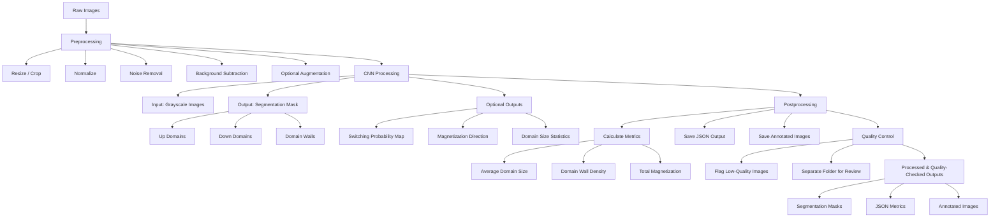

# Brainstorming / Ideas

## Simulation ideas
I think i would like to try to make a simulation on the magnetic switching(ofcourse depending on what the exact project will be). This way i can compare my experimental resulsts with the simulation results, as i would put certain physics in the simulation i can see what kind of physical processes actually contribute a lot to the outcome. I want to do it all in python as that is the only language i really know.

## CNN Processing idea
I thought about adding a CNN to automatically process the output images. I have seen many times that at least one of the outcomes of the experiments are images showing magnetic domains. If they don't already have a good automated way to process these images to get physical insight out of them, i can propose to try to make a CNN to do this. I have some experience because of the ML course at UIO so it should be doable, i could also always ask Francesco or Morten for help if needed. This would be a side project as the experiments and stuff would be the main focus of the internship, but i could always try this if i have the free time.

I would like it to be kinda structured like this:
- Preprocessing: Make sure all images are of the same size and the pixels are scaled to [0, 1], maybe even remove background noise. Steps would be: Resize/crop, normalize, nose removal, background subtraction, augmentation(optional, maybe not needed). This should ofcourse be all automated so no human supervision needed, this might reduce the workload on the people working at FELIX and lets them focus more on experiments.
- CNN Processing: Make and train an CNN to process all images, outputs would be an image showing coloured domains and a file with usefull parameters depending on what they would want to know. I should look at the best type of architecture to use, maybe U-net. The input would be the gray preprocessed images and then the output would be a segmentation mask (multi-class) showing domains. I could add secondary outputs like switching probability or overal magnetization direction or domain size statistics.
- Maybe a quality controll, like a small different CNN that does a quality check on the output images of the big CNN. This way i could automatically flag certain output images with a quality below a certain threshold/standard, so that i can ensure all outputs are of good enough quality without having to go through them all(the whole purpose of this side project idea was that i would not have to do that). Maybe i could automatically discard them or maybe better save them in a seperate folder so if needen we can always acces them.

Pipeline:
